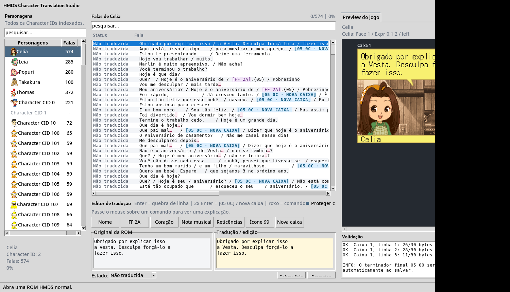
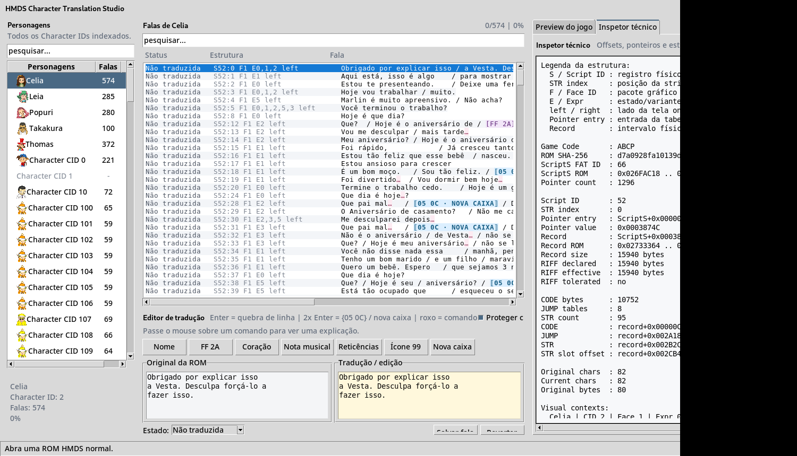

# HMDS Character Translation Studio
<p align="center">
 
</p>

Uma ferramenta feita para quem quer **traduzir Harvest Moon DS sem precisar viver no hexadecimal**.

Ela nasceu durante a tradução PT-BR do jogo. Enquanto a tradução avançava, muita coisa que normalmente seria feita na mão acabou sendo mapeada: `ScriptS`, strings, ponteiros, controles, Face IDs, expressões, preview de diálogo e várias diferenças entre ROMs antigas. O Character Translation Studio junta esse conhecimento numa interface pensada para o tradutor.

Use o projeto como uma ferramenta de apoio e referência, não como uma solução infalível. Sempre valide os resultados, teste as ROMs geradas e tenha em mente que ajustes adicionais podem ser necessários dependendo do seu projeto.

O projeto foi desenvolvido com foco na versão espanhola de Harvest Moon DS, usada como principal referência para coletar, mapear e organizar as falas do jogo. Outras versões podem ter diferenças de estrutura e compatibilidade.

**Criado por Atm**  
Versão: **0.10.0**



## O fluxo é simples

1. abra uma ROM compatível;
2. escolha o personagem;
3. abra a fala que quer trabalhar;
4. edite em **Tradução / edição**;
5. confira o preview e a validação;
6. salve a fala;
7. no fim, gere uma nova ROM.

A ROM original nunca é sobrescrita.

No editor:

- `Enter` cria uma quebra de linha;
- `Enter` duas vezes cria automaticamente `{05 0C}`, a próxima caixa de fala;
- o `05 00` físico do fim da string é preservado sem ficar poluindo o texto;
- comandos e placeholders ficam destacados para não parecerem parte da fala normal.

## O que a ferramenta já faz

- suporte público ao Harvest Moon DS normal PAL / Game Code `ABCP`;
- falas organizadas por personagem / Character ID;
- preview com retrato, Face ID, expressão e lado quando conhecidos;
- fonte e estrutura visual próximas do jogo;
- limite visual de **30 bytes por linha** e **3 linhas por caixa**;
- placeholders para valores dinâmicos e comandos;
- rebuild do banco STR e atualização de ponteiros;
- projeto de tradução separado da ROM;
- Português (Brasil), English e Español;
- Modo técnico com RIFF, Script/STR, offsets, ponteiros e chunks;
- importação/exportação para dividir o trabalho entre várias pessoas.

## Exportar e importar sem bagunça

No menu **Exportar** há algumas opções:

- **Exportar fala atual** → `.ctsdialogue`;
- **Exportar personagem completo** → `.ctspack`;
- **Exportar personagem (CSV)** → planilha;
- **Importar...** → abre `.ctsdialogue`, `.ctspack`, `.csv` e formatos antigos suportados.

Antes de importar qualquer coisa, a ferramenta abre uma comparação mostrando o texto que está no projeto e o texto que veio do arquivo. Você escolhe o que realmente quer trazer.

Se uma única fala estiver quebrada, protegida ou incompatível, **ela não cancela o pacote inteiro**. A ferramenta ignora aquela entrada, importa as outras e informa no final o que ficou de fora.

### Formatos

- `.ctsdialogue` = uma fala;
- `.ctspack` = várias falas;
- `.csv` = fluxo de planilha.

A especificação está em [docs/EXCHANGE_FORMATS.md](docs/EXCHANGE_FORMATS.md).

## Modo técnico

Você não precisa do Modo técnico para traduzir. Ele existe para quem também quer entender o jogo.

Ele mostra coisas como:

- Script ID e STR index;
- Face ID e expressão;
- `left` / `right` do retrato;
- posição do ScriptRecord dentro do `ScriptS`;
- entrada e valor da pointer table;
- RIFF declarado e efetivo;
- CODE, JUMP e STR;
- offsets dos chunks;
- anomalias toleradas pelo parser.



Exemplo:

```text
S52:12 F1 E2 left
```

quer dizer:

- `S52:12`: Script 52, STR 12;
- `F1`: Face ID 1;
- `E2`: expressão/variante do npc 2;
- `left`: retrato do npc no lado esquerdo da tela.

## Quero criar outra ferramenta em cima dela

Pode.

Uma das ideias de disponibilizar o source é justamente não prender as descobertas deste projeto a um único programa. Você pode estudar o código, fazer forks, criar scripts, criar outra interface ou aproveitar o parser em outra ferramenta **desde que seja para uso não comercial e mantenha o crédito/licença**.

Para isso existe uma API sem dependência da interface:

```python
from cts.api import Workspace

ws = Workspace.open("Harvest Moon DS.nds")
fala = ws.get_dialogue(52, 8)
print(fala.current_text)
```

Veja [docs/API.md](docs/API.md).

A ideia é que ferramentas externas usem `cts.api` em vez de depender de detalhes internos da UI. Assim a interface pode continuar evoluindo sem quebrar todo mundo que estiver usando o parser como base.

## Rodando pelo source

Recomendado: **Python 3.13 x64**.

```powershell
py -3.13 -m pip install -r requirements.txt
py -3.13 HMDS_Character_Translation_Studio.pyw
```

Ou, depois de instalar o projeto em modo editável:

```powershell
py -3.13 -m pip install -e .
py -3.13 -m cts
```

## Compilando o `.exe`

No Windows, a forma mais simples é:

```powershell
powershell -ExecutionPolicy Bypass -File .\COMPILAR_EXE.ps1
```

A build usa **Nuitka + MSVC** e gera o executável na pasta `dist/`.

Se preferir não configurar o compilador localmente, o repositório também inclui:

```text
.github/workflows/build-windows.yml
```

No GitHub, abra **Actions → Build Windows EXE → Run workflow** e baixe o artifact quando terminar.

Mais detalhes em [BUILD_FROM_SOURCE.md](BUILD_FROM_SOURCE.md).

## Estrutura do projeto

```text
cts/
├─ api.py               API recomendada para outras ferramentas
├─ engine.py            parser/rebuild da ROM e ScriptS
├─ entities.py          personagem ↔ falas/contexto
├─ dialogue_preview.py  renderer do preview
├─ validation.py        comandos, placeholders e validação
├─ project.py           projeto de tradução
├─ team.py              .ctsdialogue / .ctspack / CSV
├─ settings.py          preferências
├─ i18n.py              PT-BR / EN / ES
└─ ui.py                interface principal
```

Se quiser estudar o funcionamento interno, comece por [docs/ARCHITECTURE.md](docs/ARCHITECTURE.md) e depois [docs/API.md](docs/API.md).

## Estrutura da ROM

Durante a tradução de **Harvest Moon DS**, fui registrando descobertas sobre textos, scripts, eventos, mapas, gráficos, saves, ARM9, offsets e outras estruturas internas do jogo.

Esse material reúne caminhos, testes e interpretações encontradas durante a pesquisa. **Não significa que tudo seja a única forma correta de funcionar**, e algumas informações podem estar incompletas ou até incorretas.

Ainda assim, pode servir como referência para tradutores, ROM hackers e desenvolvedores que queiram entender melhor a ROM e continuar a pesquisa.

📖 **[Ver documentação da estrutura da ROM](docs/HMDS_ROM_HACKING_TECHNICAL_REFERENCE_PTBR.md)**

## Licença: pode estudar e criar em cima, mas não vender

O código-fonte é disponibilizado para **uso pessoal, pesquisa, preservação, fan translation e criação de ferramentas não comerciais**.

Você pode:

- estudar;
- modificar;
- fazer fork;
- compilar;
- compartilhar gratuitamente;
- criar outras ferramentas em cima do código.

Você **não pode vender** esta ferramenta, uma versão modificada dela, ou colocar o acesso a ela/derivados atrás de pagamento.

Leia os termos completos em [LICENSE](LICENSE).

> Observação: a licença do projeto cobre o código e a documentação originais. Harvest Moon DS e os materiais do jogo pertencem aos respectivos detentores de direitos.

## Contribuindo

Correções de bugs, documentação, pesquisa de formatos e melhorias que mantenham o foco em tradução são bem-vindas. Veja [CONTRIBUTING.md](CONTRIBUTING.md).

— **Atm**
